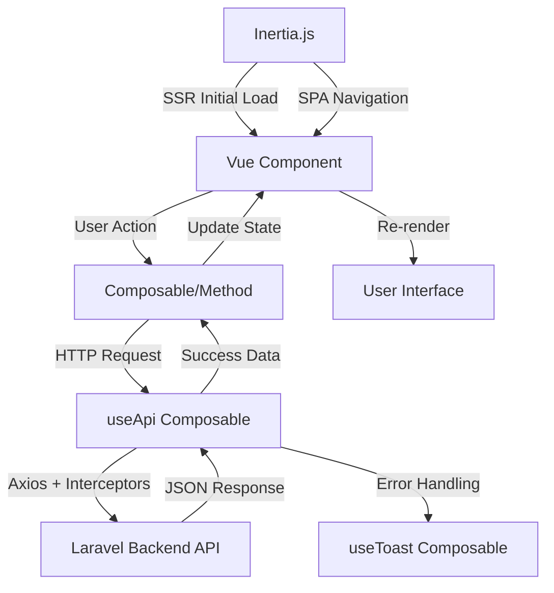
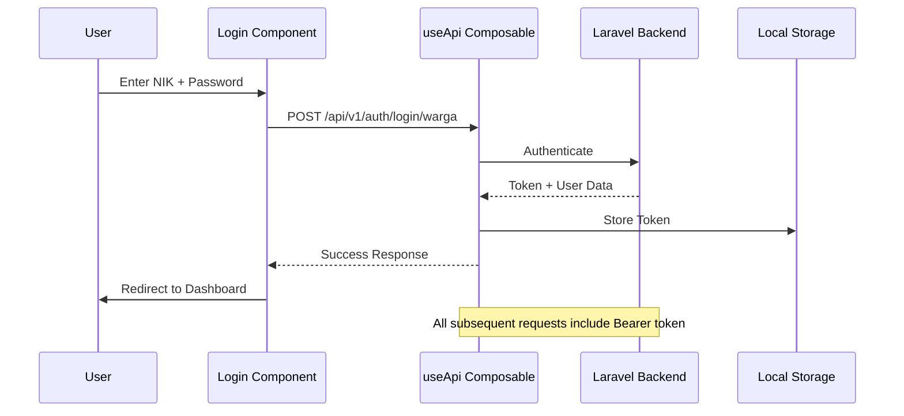

# Design Document: Modern Desaku Frontend

## Overview

The Modern Desaku Frontend is a progressive web application built with Vue 3, Inertia.js, and Tailwind CSS v4 that provides three distinct portals for the Desaku village information system:

1. **Public Portal**: Open-access area displaying village information, news, and statistics
2. **Citizen Portal**: Authenticated area for registered residents to submit letter requests and manage demographic changes
3. **Admin Dashboard**: Control panel for village officials to verify submissions and manage content

The frontend follows a mobile-first, accessibility-focused approach optimized for low-bandwidth environments typical in rural Indonesia. The application communicates with the Laravel backend via REST API using Laravel Sanctum authentication.

### Key Design Goals

- **Performance**: Lighthouse score >90 on mobile, optimized for 3G connections
- **Accessibility**: WCAG AA compliance, readable on low-end devices
- **Modularity**: Reusable component library with consistent design tokens
- **Responsiveness**: Fluid layouts that adapt seamlessly from 320px to 4K displays
- **Progressive Enhancement**: PWA capabilities with offline support for cached content


## Architecture

### Technology Stack

| Layer | Technology | Version | Purpose |
|-------|-----------|---------|---------|
| Framework | Vue 3 | 3.5+ | Reactive UI framework with Composition API |
| SSR/Routing | Inertia.js | 3.3+ | Server-side rendering and seamless SPA navigation |
| Build Tool | Vite | 8.0+ | Fast development server and optimized production builds |
| Styling | Tailwind CSS | 4.0+ | Utility-first CSS with design token configuration |
| Icons | Lucide Vue | Latest | Lightweight SVG icon library |
| State | Vue Composables | Built-in | Composition API patterns for state management |
| HTTP Client | Axios | Latest | Promise-based HTTP client with interceptors |
| Forms | Native | - | Form handling with Inertia form helper |
| Validation | Backend-driven | - | Server-side validation with client-side error display |

### Application Structure

```
resources/js/
├── app.js                    # Application entry point
├── Components/               # Reusable UI components
│   ├── Base/                # Base components (Button, Card, Input)
│   ├── Forms/               # Form-specific components
│   ├── Layout/              # Layout components (Header, Sidebar, Footer)
│   └── Domain/              # Domain-specific components
├── Layouts/                 # Page layouts
│   ├── PublicLayout.vue     # Public portal layout
│   ├── CitizenLayout.vue    # Citizen portal layout
│   └── AdminLayout.vue      # Admin dashboard layout
├── Pages/                   # Inertia pages
│   ├── Public/              # Public portal pages
│   ├── Citizen/             # Citizen portal pages
│   └── Admin/               # Admin dashboard pages
├── Composables/             # Vue composables for shared logic
│   ├── useAuth.js           # Authentication state and methods
│   ├── useApi.js            # API client with interceptors
│   ├── useToast.js          # Toast notification management
│   └── useForm.js           # Form state and validation
└── Utils/                   # Utility functions
    ├── formatters.js        # Date, number, text formatters
    ├── validators.js        # Client-side validation helpers
    └── constants.js         # Application constants
```


### Data Flow Architecture



### Authentication Flow




## Components and Interfaces

### Design Token System

The application implements a comprehensive design token system aligned with DESING.MD specifications:

```javascript
// tailwind.config.js
export default {
  theme: {
    extend: {
      colors: {
        primary: {
          DEFAULT: '#0F766E', // teal-700
          hover: '#115E59',   // teal-800
          light: '#14B8A6',   // teal-500
        },
        secondary: {
          DEFAULT: '#D97706', // amber-600
          hover: '#B45309',   // amber-700
        },
        background: '#F8FAFC', // slate-50
        surface: '#FFFFFF',
        success: '#059669',    // emerald-600
        danger: '#DC2626',     // red-600
        border: '#E2E8F0',     // slate-200
        text: {
          primary: '#1E293B',  // slate-800
          muted: '#64748B',    // slate-500
        }
      },
      fontFamily: {
        sans: ['Inter', 'system-ui', 'sans-serif'],
      },
      fontSize: {
        hero: ['clamp(2rem, 5vw, 3rem)', { lineHeight: '1.2', fontWeight: '700' }],
        section: ['clamp(1.5rem, 3vw, 2rem)', { lineHeight: '1.3', fontWeight: '600' }],
        body: ['1rem', { lineHeight: '1.5', fontWeight: '400' }],
        caption: ['0.875rem', { lineHeight: '1.4', fontWeight: '400' }],
      },
      spacing: {
        // 8pt grid system
        xs: '0.25rem',  // 4px
        sm: '0.5rem',   // 8px
        md: '1rem',     // 16px
        lg: '1.5rem',   // 24px
        xl: '2rem',     // 32px
        '2xl': '3rem',  // 48px
        '3xl': '4rem',  // 64px
      },
    },
  },
}
```


### Core Component Library

#### 1. AppButton Component

**Purpose**: Unified button component with multiple variants and states

**Props Interface**:
```typescript
interface ButtonProps {
  variant?: 'primary' | 'secondary' | 'outline' | 'danger' | 'ghost'
  size?: 'sm' | 'md' | 'lg'
  loading?: boolean
  disabled?: boolean
  fullWidth?: boolean
  icon?: Component
  iconPosition?: 'left' | 'right'
}
```

**Visual States**:
- Default: Base variant styling
- Hover: `hover:bg-opacity-90 hover:shadow-sm transition-all duration-150`
- Active: `active:scale-95`
- Disabled: `opacity-50 cursor-not-allowed pointer-events-none`
- Loading: Shows spinner icon, disables interaction

**Accessibility**:
- Semantic `<button>` element
- `aria-disabled` when disabled or loading
- `aria-busy` when loading
- Minimum touch target: 44x44px on mobile

#### 2. AppCard Component

**Purpose**: Container component for content grouping with consistent styling

**Props Interface**:
```typescript
interface CardProps {
  variant?: 'default' | 'bordered' | 'elevated'
  padding?: 'none' | 'sm' | 'md' | 'lg'
  hoverable?: boolean
  clickable?: boolean
}
```

**Features**:
- Border: `border border-border`
- Shadow: `shadow-sm hover:shadow-md transition-shadow duration-200`
- Responsive padding based on viewport
- Optional hover lift effect for interactive cards


#### 3. FormInput Component

**Purpose**: Text input with label, validation, and error display

**Props Interface**:
```typescript
interface FormInputProps {
  modelValue: string
  label: string
  type?: 'text' | 'email' | 'tel' | 'password' | 'number'
  placeholder?: string
  required?: boolean
  error?: string
  disabled?: boolean
  maxLength?: number
  autocomplete?: string
}
```

**Features**:
- Label with required indicator (red asterisk)
- Focus ring: `focus:ring-2 focus:ring-primary focus:border-primary`
- Error state: Red border + error message below input
- Character counter when maxLength provided
- Password visibility toggle for password type
- Proper mobile keyboard (inputmode) based on type

#### 4. FormSelect Component

**Purpose**: Dropdown select with consistent styling

**Props Interface**:
```typescript
interface FormSelectProps {
  modelValue: string | number
  label: string
  options: Array<{ value: string | number, label: string }>
  placeholder?: string
  required?: boolean
  error?: string
  disabled?: boolean
}
```

**Features**:
- Native `<select>` for best mobile UX
- Styled dropdown arrow indicator
- Consistent styling with FormInput
- Empty state with placeholder option


#### 5. SkeletonLoader Component

**Purpose**: Loading placeholder that mimics content shape

**Props Interface**:
```typescript
interface SkeletonProps {
  variant?: 'text' | 'card' | 'avatar' | 'image'
  count?: number
  width?: string
  height?: string
  className?: string
}
```

**Features**:
- Pulse animation: `animate-pulse bg-slate-200`
- Variant-specific shapes (rounded for avatar, rectangular for card)
- Configurable dimensions
- Reduces perceived loading time

#### 6. Toast Component

**Purpose**: Global notification system for feedback

**Interface**:
```typescript
interface Toast {
  id: string
  type: 'success' | 'error' | 'info' | 'warning'
  message: string
  duration?: number
  position?: 'top-right' | 'top-center' | 'bottom-right'
}
```

**Features**:
- Fixed positioning with z-index: 9999
- Auto-dismiss based on type (success: 3s, error: 5s)
- Slide-in animation from right
- Icon based on type (CheckCircle for success, XCircle for error)
- Manual dismiss button
- Maximum 3 toasts visible simultaneously

**Implementation Pattern**:
```javascript
// useToast.js composable
export function useToast() {
  const toasts = ref([])
  
  const showToast = (type, message, duration) => {
    const id = Date.now().toString()
    toasts.value.push({ id, type, message, duration })
    
    setTimeout(() => {
      removeToast(id)
    }, duration || (type === 'error' ? 5000 : 3000))
  }
  
  const removeToast = (id) => {
    toasts.value = toasts.value.filter(t => t.id !== id)
  }
  
  return { toasts, showToast, removeToast }
}
```


#### 7. Modal Component

**Purpose**: Overlay dialog for focused interactions

**Props Interface**:
```typescript
interface ModalProps {
  modelValue: boolean  // v-model for open/close
  title?: string
  size?: 'sm' | 'md' | 'lg' | 'xl'
  closeOnBackdrop?: boolean
  showCloseButton?: boolean
}
```

**Features**:
- Backdrop overlay: `bg-black bg-opacity-50`
- Centered modal with responsive max-width
- Slide-up animation on open
- Focus trap (focus stays within modal when open)
- ESC key to close
- Body scroll lock when open
- Accessible: `role="dialog"` `aria-modal="true"`

#### 8. StepIndicator Component

**Purpose**: Progress indicator for multi-step forms

**Props Interface**:
```typescript
interface StepIndicatorProps {
  steps: Array<{ label: string, icon?: Component }>
  currentStep: number  // 1-indexed
  clickable?: boolean
}
```

**Features**:
- Horizontal layout on desktop, vertical on mobile (<768px)
- Step states: completed (green check), active (primary color), pending (gray)
- Connecting lines between steps
- Optional click to navigate to previous steps
- Responsive labels (hide on small mobile, show on tablet+)


#### 9. StatusBadge Component

**Purpose**: Visual indicator for submission status

**Props Interface**:
```typescript
interface StatusBadgeProps {
  status: 'pending' | 'diproses' | 'selesai' | 'ditolak'
  size?: 'sm' | 'md'
}
```

**Color Mapping**:
- `pending`: Yellow (amber-600) - "Menunggu"
- `diproses`: Blue (blue-600) - "Diproses"
- `selesai`: Green (emerald-600) - "Selesai"
- `ditolak`: Red (red-600) - "Ditolak"

**Features**:
- Rounded pill shape
- Icon + text label
- Semantic color coding
- Responsive sizing

#### 10. EmptyState Component

**Purpose**: Placeholder when no data is available

**Props Interface**:
```typescript
interface EmptyStateProps {
  illustration?: string  // SVG or image path
  title: string
  description?: string
  actionLabel?: string
  actionIcon?: Component
}
```

**Features**:
- Centered layout with illustration
- Helpful message explaining why empty
- Optional CTA button to trigger action
- Responsive sizing (larger on desktop)


### Layout Components

#### PublicLayout

**Purpose**: Layout for public portal pages

**Features**:
- Sticky header with logo and navigation
- Hero section support
- Footer with village info and links
- Responsive navigation (hamburger menu on mobile)
- No authentication required

**Structure**:
```vue
<template>
  <div class="min-h-screen bg-background">
    <AppHeader :items="navItems" />
    <main>
      <slot />
    </main>
    <AppFooter />
  </div>
</template>
```

#### CitizenLayout

**Purpose**: Layout for authenticated citizen portal

**Features**:
- Header with user info and logout
- Optional sidebar for secondary navigation
- Main content area with padding
- Protected routes (requires authentication)

**Structure**:
```vue
<template>
  <div class="min-h-screen bg-background">
    <AuthHeader :user="$page.props.auth.user" />
    <div class="container mx-auto px-4 py-6">
      <slot />
    </div>
  </div>
</template>
```


#### AdminLayout

**Purpose**: Layout for admin dashboard with sidebar navigation

**Features**:
- Collapsible sidebar on desktop
- Drawer menu on mobile
- Breadcrumb navigation
- Header with search and profile menu
- Route-based active menu highlighting

**Structure**:
```vue
<template>
  <div class="min-h-screen bg-background">
    <!-- Mobile: Drawer overlay -->
    <Transition name="fade">
      <div v-if="sidebarOpen && isMobile" 
           @click="closeSidebar"
           class="fixed inset-0 bg-black bg-opacity-50 z-40" />
    </Transition>
    
    <!-- Sidebar -->
    <aside :class="sidebarClasses">
      <AdminSidebar 
        :items="menuItems" 
        :collapsed="!sidebarOpen && isDesktop"
        @close="closeSidebar" />
    </aside>
    
    <!-- Main content -->
    <div :class="mainContentClasses">
      <AdminHeader @toggle-sidebar="toggleSidebar" />
      <main class="p-4 md:p-6">
        <slot />
      </main>
    </div>
  </div>
</template>
```

**Responsive Behavior**:
- Desktop (≥1024px): Sidebar always visible, toggles between expanded/collapsed
- Mobile (<1024px): Sidebar hidden by default, slides in as drawer when toggled
- Persists collapsed state in localStorage


## Data Models

### Frontend Data Structures

The frontend works with data structures received from the Laravel backend API. These interfaces define the shape of data:

#### User Model

```typescript
interface User {
  id: number
  nik: string
  nama: string
  email?: string
  tempat_lahir: string
  tanggal_lahir: string  // YYYY-MM-DD format
  jenis_kelamin: 'L' | 'P'
  alamat: string
  rt: string
  rw: string
  dusun: string
  role: 'warga' | 'admin'
  telegram_chat_id?: string
  created_at: string
  updated_at: string
}
```

#### PengajuanSurat Model

```typescript
interface PengajuanSurat {
  id: number
  nomor_registrasi: string
  penduduk_id: number
  kategori_surat_id: number
  status: 'pending' | 'diproses' | 'selesai' | 'ditolak'
  data_formulir: Record<string, any>  // Dynamic fields based on letter type
  dokumen_pendukung: Array<{
    nama_file: string
    path: string
    size: number
  }>
  catatan_penolakan?: string
  file_surat_jadi?: string  // URL to generated PDF
  verified_by?: number
  verified_at?: string
  created_at: string
  updated_at: string
  
  // Relationships
  kategori_surat?: KategoriSurat
  penduduk?: User
}
```


#### KategoriSurat Model

```typescript
interface KategoriSurat {
  id: number
  nama: string
  kode: string
  deskripsi?: string
  icon?: string
  schema_formulir: FormSchema  // JSON schema defining form fields
  dokumen_required: Array<{
    nama: string
    format: string[]  // ['pdf', 'jpg', 'png']
    max_size: number  // in KB
    wajib: boolean
  }>
  is_active: boolean
  created_at: string
  updated_at: string
}

interface FormSchema {
  fields: Array<FormField>
}

interface FormField {
  name: string
  type: 'text' | 'textarea' | 'number' | 'date' | 'select' | 'file'
  label: string
  placeholder?: string
  required: boolean
  options?: Array<{ value: string, label: string }>  // for select type
  validation?: {
    min?: number
    max?: number
    pattern?: string
  }
}
```

#### InformasiPublik Model

```typescript
interface InformasiPublik {
  id: number
  judul: string
  slug: string
  kategori: 'berita' | 'pengumuman' | 'kegiatan' | 'artikel'
  konten: string  // HTML content
  cover_image?: string
  excerpt: string
  is_published: boolean
  published_at?: string
  views: number
  author_id: number
  created_at: string
  updated_at: string
  
  // Relationships
  author?: User
}
```


#### Statistik Model

```typescript
interface StatistikDemografi {
  total_penduduk: number
  laki_laki: number
  perempuan: number
  jumlah_keluarga: number
  jumlah_dusun: number
  luas_wilayah: string  // e.g., "12.5 km²"
  kepadatan: string  // e.g., "250 jiwa/km²"
  distribusi_usia: {
    anak: number      // 0-17 tahun
    dewasa: number    // 18-59 tahun
    lansia: number    // 60+ tahun
  }
  distribusi_pendidikan: Record<string, number>
  distribusi_pekerjaan: Record<string, number>
}

interface StatistikLayanan {
  total_pengajuan: number
  pending: number
  diproses: number
  selesai: number
  ditolak: number
  pengajuan_bulan_ini: number
  waktu_rata_rata: string  // e.g., "2 hari"
  kategori_terpopuler: Array<{
    nama: string
    jumlah: number
  }>
}
```

### API Response Format

All API responses follow this standard format:

```typescript
interface ApiResponse<T = any> {
  success: boolean
  message: string
  data?: T
  errors?: Record<string, string[]>  // Validation errors
  meta?: {
    current_page?: number
    last_page?: number
    per_page?: number
    total?: number
  }
}
```


## Error Handling

### Error Handling Strategy

The application implements a comprehensive error handling strategy across all layers to provide clear feedback and graceful degradation:

#### 1. API Error Handling

**HTTP Status Code Mapping**:

```javascript
// useApi.js composable
export function useApi() {
  const { showToast } = useToast()
  
  const apiClient = axios.create({
    baseURL: import.meta.env.VITE_API_BASE_URL,
    timeout: 30000,
    headers: {
      'Content-Type': 'application/json',
      'Accept': 'application/json',
    }
  })
  
  // Request interceptor - attach token
  apiClient.interceptors.request.use(
    (config) => {
      const token = localStorage.getItem('auth_token')
      if (token) {
        config.headers.Authorization = `Bearer ${token}`
      }
      return config
    },
    (error) => Promise.reject(error)
  )
  
  // Response interceptor - handle errors
  apiClient.interceptors.response.use(
    (response) => response.data,
    (error) => {
      if (error.response) {
        switch (error.response.status) {
          case 401:
            // Unauthorized - clear token and redirect to login
            localStorage.removeItem('auth_token')
            showToast('error', 'Sesi Anda telah berakhir. Silakan login kembali.')
            window.location.href = '/login'
            break
            
          case 403:
            // Forbidden
            showToast('error', 'Anda tidak memiliki akses ke resource ini.')
            break
            
          case 422:
            // Validation error - return errors for form handling
            return Promise.reject(error.response.data)
            
          case 429:
            // Rate limit exceeded
            showToast('error', 'Terlalu banyak permintaan. Silakan coba lagi dalam beberapa saat.')
            break
            
          case 500:
          case 502:
          case 503:
            // Server error
            showToast('error', 'Terjadi kesalahan pada server. Silakan coba lagi nanti.')
            break
            
          default:
            showToast('error', error.response.data.message || 'Terjadi kesalahan yang tidak diketahui.')
        }
      } else if (error.request) {
        // Network error - no response received
        showToast('error', 'Tidak dapat terhubung ke server. Periksa koneksi internet Anda.', 5000)
      } else {
        // Request setup error
        showToast('error', 'Terjadi kesalahan saat mengirim permintaan.')
      }
      
      return Promise.reject(error)
    }
  )
  
  return { apiClient }
}
```

#### 2. Form Validation Error Handling

**Client-Side Validation**:
- Validate input format before submission (NIK: 16 digits, email format, required fields)
- Display inline error messages below form fields as user types or on blur
- Prevent form submission if validation fails

**Server-Side Validation**:
- Handle 422 validation errors from backend
- Map backend error messages to corresponding form fields
- Preserve user input on validation failure to prevent data loss

**Implementation Pattern**:

```javascript
// useForm.js composable
export function useForm(initialData) {
  const formData = ref({ ...initialData })
  const errors = ref({})
  const processing = ref(false)
  
  const setError = (field, message) => {
    errors.value[field] = message
  }
  
  const clearError = (field) => {
    delete errors.value[field]
  }
  
  const clearErrors = () => {
    errors.value = {}
  }
  
  const handleValidationErrors = (backendErrors) => {
    // Backend returns errors as { field: ['error message 1', 'error message 2'] }
    Object.keys(backendErrors).forEach(field => {
      errors.value[field] = backendErrors[field][0]  // Show first error message
    })
  }
  
  const submit = async (url, method = 'POST') => {
    clearErrors()
    processing.value = true
    
    try {
      const response = await apiClient[method.toLowerCase()](url, formData.value)
      return response
    } catch (error) {
      if (error.errors) {
        handleValidationErrors(error.errors)
      }
      throw error
    } finally {
      processing.value = false
    }
  }
  
  return {
    formData,
    errors,
    processing,
    setError,
    clearError,
    clearErrors,
    submit,
  }
}
```

#### 3. Network Error Handling

**Offline Detection**:
```javascript
// useNetworkStatus.js composable
export function useNetworkStatus() {
  const isOnline = ref(navigator.onLine)
  const showOfflineBanner = ref(false)
  
  const updateOnlineStatus = () => {
    isOnline.value = navigator.onLine
    showOfflineBanner.value = !navigator.onLine
    
    if (navigator.onLine) {
      // Auto-dismiss offline banner when back online
      setTimeout(() => {
        showOfflineBanner.value = false
      }, 3000)
    }
  }
  
  onMounted(() => {
    window.addEventListener('online', updateOnlineStatus)
    window.addEventListener('offline', updateOnlineStatus)
  })
  
  onUnmounted(() => {
    window.removeEventListener('online', updateOnlineStatus)
    window.removeEventListener('offline', updateOnlineStatus)
  })
  
  return { isOnline, showOfflineBanner }
}
```

**Request Retry Logic**:
- Implement exponential backoff for failed network requests
- Maximum 3 retry attempts with delays: 1s, 2s, 4s
- Show retry button for user-initiated retry

#### 4. UI Error States

**Empty State Handling**:
- Display helpful EmptyState component when no data is available
- Provide context-specific messages and illustrations
- Include CTA button to guide user to relevant action

**Loading State Handling**:
- Always show SkeletonLoader during data fetching (>300ms)
- Prevent layout shift with consistent placeholder dimensions
- Disable interactive elements during loading

**Error State Display**:
- Toast notifications for transient errors (auto-dismiss)
- Inline error messages for form validation (persistent until corrected)
- Full-page error state for critical failures with retry option

#### 5. Error Logging

**Client-Side Error Logging**:
```javascript
// Global error handler
window.addEventListener('error', (event) => {
  console.error('Global error:', {
    message: event.message,
    filename: event.filename,
    lineno: event.lineno,
    colno: event.colno,
    error: event.error
  })
  
  // Optional: Send to error tracking service (Sentry, LogRocket, etc.)
  // errorTracker.captureException(event.error)
})

window.addEventListener('unhandledrejection', (event) => {
  console.error('Unhandled promise rejection:', event.reason)
  // errorTracker.captureException(event.reason)
})
```


## Testing Strategy

### Testing Approach Overview

Given that this feature is primarily a **frontend UI application** with components, forms, API integration, and responsive layouts, **Property-Based Testing is NOT applicable**. Instead, the testing strategy focuses on:

1. **Component Unit Tests** - Example-based tests for individual components
2. **Component Snapshot Tests** - Visual regression testing for UI consistency
3. **Integration Tests** - API communication and data flow
4. **End-to-End Tests** - Critical user journeys
5. **Manual Accessibility Testing** - WCAG compliance verification

### 1. Component Unit Tests

**Testing Framework**: Vitest + Vue Test Utils

**Scope**: Test individual component behavior with specific examples

**Example Test Cases**:

```javascript
// AppButton.spec.js
import { mount } from '@vue/test-utils'
import { describe, it, expect } from 'vitest'
import AppButton from '@/Components/Base/AppButton.vue'

describe('AppButton', () => {
  it('renders button text correctly', () => {
    const wrapper = mount(AppButton, {
      props: { variant: 'primary' },
      slots: { default: 'Click Me' }
    })
    expect(wrapper.text()).toBe('Click Me')
  })
  
  it('applies primary variant styles', () => {
    const wrapper = mount(AppButton, {
      props: { variant: 'primary' }
    })
    expect(wrapper.classes()).toContain('bg-primary')
  })
  
  it('shows loading spinner when loading prop is true', () => {
    const wrapper = mount(AppButton, {
      props: { loading: true }
    })
    expect(wrapper.find('.spinner').exists()).toBe(true)
  })
  
  it('disables button when disabled prop is true', () => {
    const wrapper = mount(AppButton, {
      props: { disabled: true }
    })
    expect(wrapper.attributes('disabled')).toBeDefined()
  })
  
  it('emits click event when clicked and not disabled', async () => {
    const wrapper = mount(AppButton)
    await wrapper.trigger('click')
    expect(wrapper.emitted('click')).toBeTruthy()
  })
  
  it('does not emit click event when disabled', async () => {
    const wrapper = mount(AppButton, {
      props: { disabled: true }
    })
    await wrapper.trigger('click')
    expect(wrapper.emitted('click')).toBeFalsy()
  })
})
```

**Components to Test**:
- AppButton (all variants, states, interactions)
- FormInput (validation, error display, type-specific behavior)
- FormSelect (option rendering, selection, error state)
- Modal (open/close, backdrop interaction, ESC key)
- Toast (auto-dismiss timing, manual dismiss, type styling)
- StatusBadge (color mapping, text display)
- StepIndicator (step states, progress indication)

### 2. Component Snapshot Tests

**Purpose**: Detect unintended visual changes in component rendering

**Implementation**:

```javascript
// AppButton.snapshot.spec.js
import { mount } from '@vue/test-utils'
import { describe, it, expect } from 'vitest'
import AppButton from '@/Components/Base/AppButton.vue'

describe('AppButton Snapshots', () => {
  it('matches snapshot for primary variant', () => {
    const wrapper = mount(AppButton, {
      props: { variant: 'primary' },
      slots: { default: 'Primary Button' }
    })
    expect(wrapper.html()).toMatchSnapshot()
  })
  
  it('matches snapshot for loading state', () => {
    const wrapper = mount(AppButton, {
      props: { loading: true },
      slots: { default: 'Loading...' }
    })
    expect(wrapper.html()).toMatchSnapshot()
  })
  
  it('matches snapshot for disabled state', () => {
    const wrapper = mount(AppButton, {
      props: { disabled: true },
      slots: { default: 'Disabled' }
    })
    expect(wrapper.html()).toMatchSnapshot()
  })
})
```

**Coverage**: All major components, all variants, all states

### 3. Integration Tests

**Scope**: Test API communication, data flow, and component interaction

**Example Test Cases**:

```javascript
// CitizenDashboard.integration.spec.js
import { mount } from '@vue/test-utils'
import { describe, it, expect, vi, beforeEach } from 'vitest'
import CitizenDashboard from '@/Pages/Citizen/Dashboard.vue'
import axios from 'axios'

vi.mock('axios')

describe('Citizen Dashboard Integration', () => {
  beforeEach(() => {
    vi.clearAllMocks()
  })
  
  it('fetches and displays pengajuan surat list on mount', async () => {
    const mockData = {
      success: true,
      data: [
        {
          id: 1,
          nomor_registrasi: 'REG-001',
          kategori_surat: { nama: 'Surat Pengantar' },
          status: 'pending',
          created_at: '2025-01-15T10:00:00Z'
        }
      ]
    }
    
    axios.get.mockResolvedValue({ data: mockData })
    
    const wrapper = mount(CitizenDashboard)
    
    // Wait for API call and component update
    await wrapper.vm.$nextTick()
    await new Promise(resolve => setTimeout(resolve, 0))
    
    expect(axios.get).toHaveBeenCalledWith('/api/citizen/pengajuan-surat')
    expect(wrapper.text()).toContain('REG-001')
    expect(wrapper.text()).toContain('Surat Pengantar')
  })
  
  it('displays empty state when no submissions exist', async () => {
    axios.get.mockResolvedValue({
      data: { success: true, data: [] }
    })
    
    const wrapper = mount(CitizenDashboard)
    await wrapper.vm.$nextTick()
    await new Promise(resolve => setTimeout(resolve, 0))
    
    expect(wrapper.findComponent({ name: 'EmptyState' }).exists()).toBe(true)
  })
  
  it('handles API error gracefully', async () => {
    axios.get.mockRejectedValue(new Error('Network Error'))
    
    const wrapper = mount(CitizenDashboard)
    await wrapper.vm.$nextTick()
    await new Promise(resolve => setTimeout(resolve, 0))
    
    // Should display error toast (check if useToast was called)
    // Or check for error state in component
    expect(wrapper.vm.error).toBeTruthy()
  })
})
```

**Integration Test Coverage**:
- Login flow (Requirements 5)
- Citizen dashboard data fetching (Requirements 6)
- Multi-step form submission (Requirements 7)
- Admin verification workflow (Requirements 11)
- Public portal statistics display (Requirements 3)

### 4. End-to-End Tests

**Testing Framework**: Playwright or Cypress

**Scope**: Test complete user journeys across multiple pages

**Critical User Journeys**:

1. **Citizen Letter Submission Journey**:
   ```javascript
   test('citizen can submit a letter request', async ({ page }) => {
     // Login
     await page.goto('/login')
     await page.fill('input[name="nik"]', '3201234567890123')
     await page.fill('input[name="password"]', 'password123')
     await page.click('button[type="submit"]')
     
     // Navigate to letter catalog
     await page.waitForURL('/citizen/dashboard')
     await page.click('text=Surat Pengantar')
     
     // Fill multi-step form
     await page.waitForURL('/citizen/pengajuan-surat/*')
     
     // Step 1: Auto-filled data (just verify)
     expect(await page.textContent('input[name="nama"]')).toBeTruthy()
     await page.click('button:has-text("Selanjutnya")')
     
     // Step 2: Additional data
     await page.fill('input[name="keperluan"]', 'Melamar pekerjaan')
     await page.setInputFiles('input[type="file"]', 'test-files/ktp.jpg')
     await page.click('button:has-text("Selanjutnya")')
     
     // Step 3: Review and submit
     expect(await page.textContent('text=Melamar pekerjaan')).toBeTruthy()
     await page.click('button:has-text("Kirim Pengajuan")')
     
     // Verify success
     await page.waitForSelector('text=berhasil')
     await page.waitForURL('/citizen/dashboard')
     expect(await page.textContent('text=REG-')).toBeTruthy()
   })
   ```

2. **Admin Verification Journey**:
   ```javascript
   test('admin can verify and approve letter submission', async ({ page }) => {
     await page.goto('/admin/login')
     await page.fill('input[name="email"]', 'admin@example.com')
     await page.fill('input[name="password"]', 'admin123')
     await page.click('button[type="submit"]')
     
     await page.waitForURL('/admin/dashboard')
     await page.click('text=Pengajuan Surat')
     
     // Filter pending submissions
     await page.click('button:has-text("Pending")')
     
     // Click first submission
     await page.click('table tbody tr:first-child')
     
     // Verify data is displayed
     expect(await page.textContent('text=Data Pemohon')).toBeTruthy()
     
     // Approve submission
     await page.click('button:has-text("Setujui")')
     await page.click('button:has-text("Konfirmasi")')
     
     // Verify success toast
     await page.waitForSelector('text=berhasil disetujui')
   })
   ```

3. **Public Portal Navigation**:
   ```javascript
   test('visitor can browse public portal', async ({ page }) => {
     await page.goto('/')
     
     // Verify hero section
     expect(await page.textContent('h1')).toContain('Selamat Datang')
     
     // Verify statistics cards
     expect(await page.textContent('text=Jumlah Penduduk')).toBeTruthy()
     
     // Navigate to profile
     await page.click('text=Profil Desa')
     await page.waitForURL('/profil')
     expect(await page.textContent('text=Sejarah')).toBeTruthy()
     
     // Navigate to news
     await page.goto('/')
     await page.click('article:first-child')
     expect(await page.locator('article').count()).toBeGreaterThan(0)
   })
   ```

### 5. Responsive Design Testing

**Manual Testing Matrix**:

| Viewport | Width | Device Example | Key Tests |
|----------|-------|----------------|-----------|
| Mobile S | 320px | iPhone SE | Layout no horizontal scroll, touch targets ≥44px |
| Mobile M | 375px | iPhone 12 | Forms usable, drawer menu accessible |
| Mobile L | 425px | iPhone 12 Pro Max | Multi-column cards stack vertically |
| Tablet | 768px | iPad | Sidebar converts to drawer, tables remain readable |
| Laptop | 1024px | MacBook Air | Sidebar visible, tables display all columns |
| Desktop | 1440px | iMac | Optimal spacing, no excessive whitespace |

**Automated Responsive Tests**:
```javascript
// Playwright viewport testing
const viewports = [
  { name: 'Mobile', width: 375, height: 667 },
  { name: 'Tablet', width: 768, height: 1024 },
  { name: 'Desktop', width: 1440, height: 900 }
]

viewports.forEach(({ name, width, height }) => {
  test(`renders correctly on ${name}`, async ({ page }) => {
    await page.setViewportSize({ width, height })
    await page.goto('/citizen/dashboard')
    
    // Take screenshot for visual regression
    await expect(page).toHaveScreenshot(`dashboard-${name}.png`)
  })
})
```

### 6. Accessibility Testing

**Automated Tools**:
- **axe-core** via Playwright or Cypress for automated WCAG checks
- **Lighthouse CI** as part of build process

**Manual Testing Checklist**:
- [ ] Keyboard navigation works for all interactive elements (Tab, Enter, Esc)
- [ ] Focus indicators visible and clear
- [ ] Screen reader announces page structure correctly (test with NVDA/JAWS)
- [ ] Color contrast meets WCAG AA (text 4.5:1, large text 3:1)
- [ ] All images have meaningful alt text
- [ ] Form errors announced to screen readers
- [ ] Modal focus trap works correctly
- [ ] Skip to main content link present

**Example Accessibility Test**:
```javascript
test('dashboard is accessible', async ({ page }) => {
  await page.goto('/citizen/dashboard')
  
  // Run axe accessibility scan
  const accessibilityScanResults = await new AxeBuilder({ page }).analyze()
  expect(accessibilityScanResults.violations).toEqual([])
  
  // Test keyboard navigation
  await page.keyboard.press('Tab')
  const focusedElement = await page.evaluate(() => document.activeElement.tagName)
  expect(['A', 'BUTTON', 'INPUT']).toContain(focusedElement)
})
```

### 7. Performance Testing

**Lighthouse CI Integration**:
- Run on every pull request
- Minimum scores: Performance 90, Accessibility 90, Best Practices 90, SEO 90
- Fail build if scores drop below thresholds

**Example Configuration** (`.lighthouserc.json`):
```json
{
  "ci": {
    "collect": {
      "url": [
        "http://localhost:3000/",
        "http://localhost:3000/login",
        "http://localhost:3000/citizen/dashboard"
      ],
      "numberOfRuns": 3
    },
    "assert": {
      "assertions": {
        "categories:performance": ["error", { "minScore": 0.9 }],
        "categories:accessibility": ["error", { "minScore": 0.9 }],
        "categories:best-practices": ["error", { "minScore": 0.9 }],
        "categories:seo": ["error", { "minScore": 0.9 }],
        "first-contentful-paint": ["error", { "maxNumericValue": 2000 }],
        "interactive": ["error", { "maxNumericValue": 3500 }]
      }
    }
  }
}
```

### 8. Test Coverage Goals

**Unit Test Coverage**: ≥80% for components and composables
**Integration Test Coverage**: All critical API endpoints
**E2E Test Coverage**: All major user journeys (citizen submission, admin verification, public browsing)

**Coverage Command**:
```bash
npm run test:coverage
```

### Testing Pyramid

```
        /\
       /  \
      / E2E \       ~10 tests (Critical journeys)
     /--------\
    /          \
   / Integration \   ~30 tests (API + data flow)
  /--------------\
 /                \
/   Unit Tests     \  ~100+ tests (Components + logic)
--------------------
```

### Continuous Integration

**GitHub Actions Workflow** (`.github/workflows/test.yml`):
```yaml
name: Test Suite

on: [push, pull_request]

jobs:
  test:
    runs-on: ubuntu-latest
    steps:
      - uses: actions/checkout@v3
      - uses: actions/setup-node@v3
        with:
          node-version: '20'
      
      - name: Install dependencies
        run: npm ci
      
      - name: Run unit tests
        run: npm run test:unit
      
      - name: Run integration tests
        run: npm run test:integration
      
      - name: Build application
        run: npm run build
      
      - name: Run E2E tests
        run: npm run test:e2e
      
      - name: Run Lighthouse CI
        run: npm run lighthouse
```


---

## Summary

This design document provides a comprehensive technical specification for the Modern Desaku Frontend application. Key highlights:

1. **Component-Driven Architecture**: Modular, reusable components with consistent design tokens aligned with DESING.MD specifications
2. **Mobile-First Responsive Design**: Fluid layouts optimized for rural Indonesia's mobile-dominant usage patterns
3. **Performance-Optimized**: Lazy loading, code splitting, compression, and PWA capabilities for low-bandwidth environments
4. **Accessibility-Focused**: WCAG AA compliance with semantic HTML, keyboard navigation, and screen reader support
5. **Comprehensive Error Handling**: Multi-layered error handling strategy from network to form validation
6. **Robust Testing Strategy**: Unit tests, snapshot tests, integration tests, and E2E tests for critical user journeys

The application communicates with the Laravel backend via REST API using Laravel Sanctum authentication, providing three distinct portals (Public, Citizen, Admin) with optimized user experiences for each role.

**Next Steps**: Proceed to task creation phase to break down implementation into actionable development tasks.

