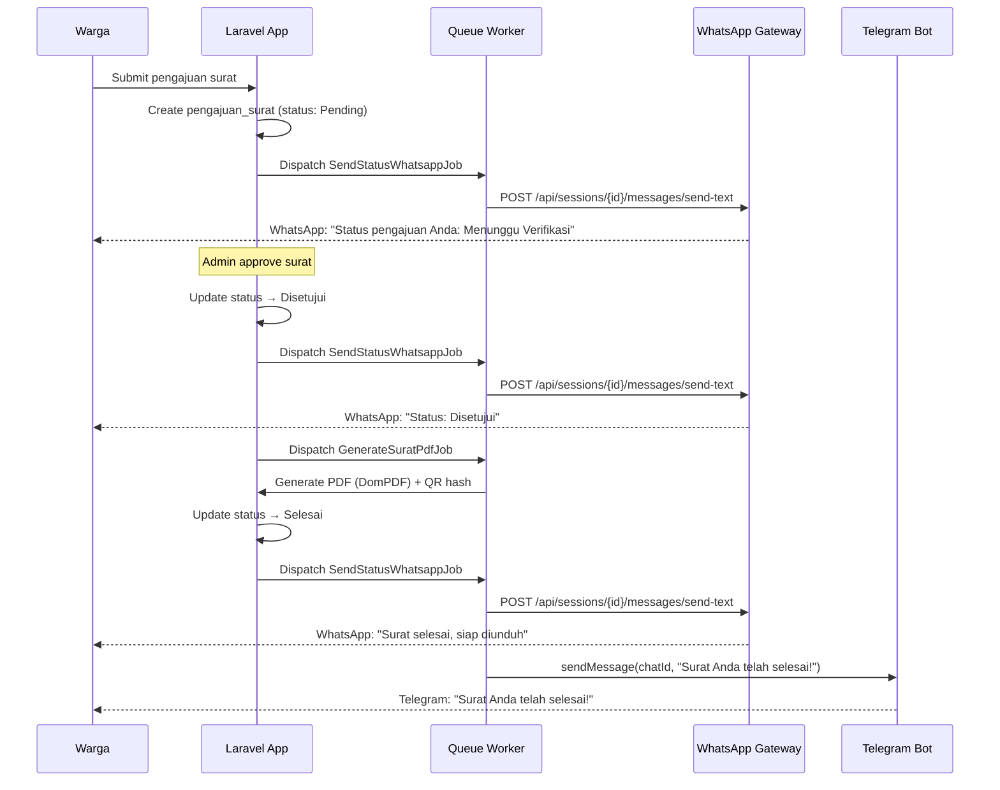
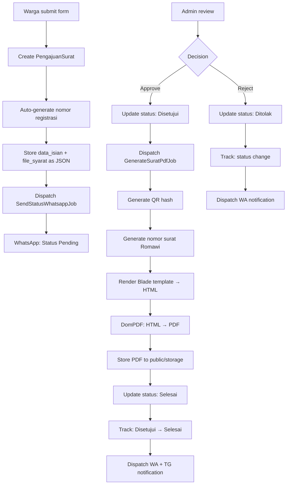

# Arsitektur Sistem SIG-Udeung

## Ringkasan Sistem

SIG-Udeung adalah Sistem Informasi Gampong untuk **Gampong Udeung, Pidie Jaya, Aceh**. Sistem ini terdiri dari dua komponen utama:

1. **Laravel Application** — Backend web (MVC) + API, queue worker, PDF generation
2. **WhatsApp Gateway** — Microservice Node.js (Baileys) untuk notifikasi WhatsApp dengan behavior engine

```
┌─────────────────────────────────────────────────────────────────┐
│                        PRODUCTION ENVIRONMENT                   │
│                                                                 │
│  ┌──────────────────────┐     HTTP      ┌─────────────────────┐│
│  │                      │ ──────────────▶│                     ││
│  │   Laravel App        │                │  WhatsApp Gateway   ││
│  │   (PHP 8.x)         │◀────────────── │  (Node.js + Baileys)││
│  │                      │   Webhook      │                     ││
│  │  • Controllers       │                │  • Auth State (SQLite)│
│  │  • Models (Eloquent) │                │  • Behavior Engine  ││
│  │  • Services          │                │  • Session Manager  ││
│  │  • Jobs (Queue)      │                │  • Webhook Delivery ││
│  └──────┬───────────────┘                └─────────────────────┘│
│         │                                                         │
│         │ HTTP                                                    │
│         ▼                                                         │
│  ┌──────────────────────┐     HTTP      ┌─────────────────────┐│
│  │   Telegram Bot API   │◀───────────── │  TelegramService    ││
│  └──────────────────────┘                └─────────────────────┘│
│                                                                 │
│  ┌──────────────────────┐                                       │
│  │   MySQL Database     │  ← Laravel (penduduk, pengajuan_surat,│
│  └──────────────────────┘    tracking, kategori_surat, etc.)    │
│                                                                 │
│  ┌──────────────────────┐                                       │
│  │   SQLite (wagateway) │  ← WA Gateway (auth_state, sessions,  │
│  └──────────────────────┘    behavior_config, user_profiles)    │
└─────────────────────────────────────────────────────────────────┘
```

---

## 1. Laravel Application

### MVC Structure

```
app/
├── Console/          # Artisan commands
├── Http/
│   ├── Controllers/
│   │   ├── Auth/          # Login/register warga & admin
│   │   ├── Admin/         # Dashboard admin, pengajuan management
│   │   ├── Warga/         # Portal warga, pengajuan surat
│   │   ├── Api/           # REST API endpoints
│   │   └── PengaturanFrontend.php  # Frontend settings CRUD
│   ├── Middleware/
│   └── Requests/
├── Models/           # 18 Eloquent models
├── Services/         # Business logic layer
└── Jobs/             # Async queue jobs
```

### Models Utama & Relationships

| Model | Tabel | PK | Keterangan |
|-------|-------|----|------------|
| `Penduduk` | `penduduk` | `nik` (string) | Data warga, extends `Authenticatable` |
| `PengajuanSurat` | `pengajuan_surat` | `id` (ULID) | Pengajuan surat desa |
| `TrackingPengajuanSurat` | `tracking_pengajuan_surat` | `id` (ULID) | Log perubahan status |
| `KategoriSurat` | `kategori_surat` | `id` (ULID) | Template/jenis surat |
| `FasilitasDesa` | `fasilitas_desa` | `id` (ULID) | Data fasilitas desa |
| `PengaturanGampong` | `pengaturan_gampong` | — | Pengaturan umum desa |
| `PengaturanFrontend` | `pengaturan_frontend` | `kunci` (string) | Pengaturan konten frontend |
| `MutasiPenduduk` | `mutasi_penduduk` | — | Riwayat mutasi warga |
| `TrafficLog` | `traffic_log` | — | Log kunjungan website |

**Relationships Penting:**

```
PengajuanSurat
├── belongsTo → Penduduk (via nik_pemohon → nik)
├── belongsTo → KategoriSurat (via kategori_surat_id)
├── belongsTo → Administrator (via diverifikasi_oleh)
└── hasMany   → TrackingPengajuanSurat (via pengajuan_surat_id)

Penduduk
└── hasMany → PengajuanSurat (via nik)
```

**Nomor Registrasi Otomatis:**
Format `YYYYMMDD-XXXX` (contoh: `20260711-0001`). Counter direset setiap hari via `boot()` method di `PengajuanSurat`.

### Service Layer

| Service | Fungsi | Dependency |
|---------|--------|------------|
| `WhatsAppService` | Kirim pesan WA via wa-gateway atau Fonnte | `config('services.whatsapp')` |
| `TelegramService` | Kirim pesan/foto via Bot API Telegram | `config('services.telegram')` |
| `PdfGeneratorService` | Generate PDF surat dari template Blade + QR code | DomPDF, Storage |
| `StatistikService` | Query statistik untuk dashboard admin | — |
| `ImageService` | Proses gambar/foto | — |
| `GeminiAiService` | AI chatbot via Google Gemini | `config('services.gemini')` |
| `FallbackAiService` | Fallback AI provider | — |
| `TelegramKnowledgeService` | Knowledge base untuk Telegram bot | — |

### Job Queue

| Job | Fungsi | Retry | Trigger |
|-----|--------|-------|---------|
| `SendStatusWhatsappJob` | Kirim notifikasi status surat ke warga via WA | 3× | Saat status berubah |
| `GenerateSuratPdfJob` | Generate PDF + update status ke "Selesai" | default | Admin approve → `Disetujui` |
| `SendNewsWhatsappNotificationJob` | Broadcast berita via WA | 3× | Berita dipublish |
| `SendNewsTelegramNotificationJob` | Broadcast berita via Telegram | 3× | Berita dipublish |
| `ProcessTelegramMessageJob` | Proses pesan masuk Telegram | — | Webhook Telegram |
| `ProcessTelegramBroadcastJob` | Proses broadcast ke grup Telegram | — | Admin broadcast |

---

## 2. WhatsApp Gateway (VPS)

Microservice Node.js yang berjalan terpisah dari Laravel, terhubung via HTTP REST API + webhook.

### Auth Flow

```
┌──────────────────────────────────────────────────────────┐
│                    AUTH STATE FLOW                         │
│                                                           │
│  1. connectSession(sessionId)                              │
│     │                                                      │
│     ▼                                                      │
│  2. getAuthStateForBaileys(sessionId)                      │
│     │                                                      │
│     ├── Cache hit? → return cached {creds, keys}           │
│     │                                                      │
│     ├── DB hit?   → parse JSON from auth_state table       │
│     │               cache in-memory Map                    │
│     │               return {creds, keys}                   │
│     │                                                      │
│     └── New session? → initAuthCreds() (Baileys)           │
│                       INSERT INTO auth_state               │
│                       cache + return                       │
│                                                           │
│  3. Baileys connects with auth state                       │
│     │                                                      │
│     ▼                                                      │
│  4. On creds.update → saveAuthCreds(sessionId, creds)      │
│     ├── Object.assign(entry.creds, creds)  ← FIX          │
│     ├── cache.set(sessionId, entry)                        │
│     └── UPSERT auth_state (JSON.stringify)                 │
└──────────────────────────────────────────────────────────┘
```

**Mengapa `Object.assign` untuk merge creds:**

Baileys memanggil `saveCreds()` dengan credential baru yang _partial_. Jika kita langsung `cache.set(sessionId, { creds: newCreds })`, kita kehilangan field lama yang belum diupdate. `Object.assign(entry.creds, creds)` _merge_ field baru ke objek yang sudah ada, menjaga konsistensi. Ini adalah fix untuk bug di mana `state.get` tidak bisa menemukan key setelah creds di-overwrite.

### Behavior Engine

Pipeline pemrosesan pesan masuk dengan simulasi manusia:

```
Incoming Message
    │
    ▼
┌─────────────────────────────────────┐
│ 1. Build Features                   │
│    [avg_response_time, msg/day,     │
│     text_length, hour_of_day]       │
├─────────────────────────────────────┤
│ 2. Online K-Means (Persona)         │
│    → quick / normal / relaxed       │
├─────────────────────────────────────┤
│ 3. Volume Control (Token Bucket)    │
│    → per_minute: 3, per_hour: 20    │
├─────────────────────────────────────┤
│ 4. Safety Engine                    │
│    → burst detection, quiet hours   │
├─────────────────────────────────────┤
│ 5. Content Generation               │
│    → FAQ match / AI (OpenAI/Gemini) │
│    → template response              │
├─────────────────────────────────────┤
│ 6. Diversity Check                  │
│    → vary content if repetitive     │
├─────────────────────────────────────┤
│ 7. Timing Simulation                │
│    → read delay → typing → send     │
├─────────────────────────────────────┤
│ 8. Send via Baileys socket          │
│    → sock.sendMessage(jid, text)    │
├─────────────────────────────────────┤
│ 9. Record to behavior_outbox        │
│    → analytics + dedup              │
└─────────────────────────────────────┘
```

**Komponen Behavior Engine:**

| Module | File | Fungsi |
|--------|------|--------|
| `OnlineKMeans` | `behavior/persona.js` | Clustering user → persona (`quick`, `normal`, `relaxed`) |
| `AdaptiveTiming` | `behavior/timing.js` | Simulasi delay baca + ketik berdasarkan persona |
| `AdaptiveTokenBucket` | `behavior/volume.js` | Rate limiting adaptif per user |
| `SafetyEngine` | `behavior/anti-ban.js` | Burst detection, quiet hours (22:00–07:00 WIB) |
| `DiversityEngine` | `behavior/anti-ban.js` | Variasi konten agar tidak repetitif |
| `getContent` | `behavior/content.js` | FAQ matching, AI call, template rendering |

### Proxy Support (WARP SOCKS5)

```javascript
// session.js
const proxyUrl = process.env.SOCKS5_PROXY;
const agent = proxyUrl ? new SocksProxyAgent(proxyUrl) : undefined;

session.sock = makeWASocket({
    agent,  // SOCKS5 proxy (Cloudflare WARP)
    // ...
});
```

Cloudflare WARP digunakan untuk mengubah IP agar terlihat dari Indonesia, mengurangi risiko ban oleh WhatsApp.

---

## 3. Database Schema

### MySQL (Laravel) — Tabel Utama

#### `penduduk`

| Kolom | Tipe | Keterangan |
|-------|------|------------|
| `nik` | `VARCHAR(16)` PK | Nomor Induk Kependudukan |
| `no_kk` | `VARCHAR(16)` FK | Nomor Kartu Keluarga → `keluarga.no_kk` |
| `nama_lengkap` | `VARCHAR(100)` | Nama lengkap |
| `tempat_lahir` | `VARCHAR(50)` | Tempat lahir |
| `tanggal_lahir` | `DATE` | Tanggal lahir |
| `jenis_kelamin` | `ENUM('L','P')` | Jenis kelamin |
| `agama` | `VARCHAR(20)` | Agama |
| `pendidikan` | `VARCHAR(50)` | Pendidikan terakhir |
| `pekerjaan` | `VARCHAR(50)` | Pekerjaan |
| `status_perkawinan` | `VARCHAR(20)` | Status kawin |
| `status_keluarga` | `VARCHAR(30)` | Hubungan dalam KK |
| `status_mutasi` | `ENUM('Tetap','Pindah','Meninggal')` | Default: Tetap |
| `telegram_chat_id` | `VARCHAR(50)` UNIQUE, nullable | ID chat Telegram |
| `no_hp` | — | Nomor HP (fillable, tidak di migration awal) |
| `foto_profil/foto_ktp/foto_kk` | — | Path foto |

#### `pengajuan_surat`

| Kolom | Tipe | Keterangan |
|-------|------|------------|
| `id` | `ULID` PK | Auto-generated |
| `nomor_registrasi` | `VARCHAR(30)` UNIQUE | Format: `YYYYMMDD-XXXX` |
| `nik_pemohon` | `VARCHAR(16)` FK | → `penduduk.nik`, cascade delete |
| `kategori_surat_id` | `ULID` FK | → `kategori_surat.id`, restrict |
| `data_isian` | `JSON` | Isian form dinamis |
| `file_syarat` | `JSON` | Daftar file dokumen syarat |
| `status` | `ENUM` | `Pending → Diproses → Disetujui/Ditolak → Selesai` |
| `catatan_penolakan` | `TEXT` nullable | Alasan penolakan |
| `qr_hash` | `VARCHAR(64)` UNIQUE nullable | SHA-256 hash untuk QR verifikasi |
| `file_pdf_url` | `VARCHAR` nullable | URL PDF surat jadi |
| `nomor_surat` | — | Nomor surat resmi (Romawi) |
| `diverifikasi_oleh` | `ULID` FK nullable | → `administrators.id`, null on delete |

#### `tracking_pengajuan_surat`

| Kolom | Tipe | Keterangan |
|-------|------|------------|
| `id` | `ULID` PK | Auto-generated |
| `pengajuan_surat_id` | `ULID` FK | → `pengajuan_surat.id` |
| `status_sebelumnya` | `VARCHAR` nullable | Status sebelum perubahan |
| `status_baru` | `VARCHAR` | Status setelah perubahan |
| `keterangan_update` | `TEXT` nullable | Catatan perubahan |
| `diupdate_oleh` | `ULID` FK nullable | Admin yang melakukan update |

#### `pengaturan_frontend`

| Kolom | Tipe | Keterangan |
|-------|------|------------|
| `kunci` | `VARCHAR(50)` PK | Key pengaturan (contoh: `nama_sekdes`) |
| `nilai` | `TEXT` nullable | Nilai pengaturan |
| `tipe_data` | `VARCHAR(20)` | Default: `string` |
| `deskripsi` | `VARCHAR` nullable | Deskripsi pengaturan |

---

### SQLite (WA Gateway) — `wagateway.db`

Tabel ini dikelola oleh `wa-gateway/src/db.js` menggunakan `better-sqlite3`.

| Tabel | Fungsi |
|-------|--------|
| `sessions` | Status koneksi per session (connected/disconnected/waiting_qr) |
| `auth_state` | Credentials + keys Baileys (JSON) per session |
| `messages` | Log semua pesan (queued/sent/failed) + status delivery |
| `webhook_outbox` | Event queue untuk dikirim ke Laravel (retry 5×) |
| `user_profiles` | Profil pengguna per session + persona assignment |
| `behavior_config` | Konfigurasi behavior engine per session |
| `behavior_outbox` | Log respons yang sudah dikirim (dedup + analytics) |
| `faq_entries` | FAQ entries untuk auto-reply |
| `template_entries` | Template respons per intent |

---

## 4. Notification Flow

### Flow Pengajuan Surat → Notifikasi



### WhatsApp Dual Provider

`WhatsAppService` mendukung dua provider:

| Provider | Endpoint | Autentikasi | Use Case |
|----------|----------|-------------|----------|
| **wa-gateway** | `POST /api/sessions/{sessionId}/messages/send-text` | `X-API-Key` header | Self-hosted, full control, behavior engine |
| **Fonnte** | `POST https://api.fonnte.com/send` | `Authorization` header | SaaS fallback, lebih simpel |

Konfigurasi via `.env`:
```env
WHA_PROVIDER=wa-gateway          # atau "fonnte"
WHA_GATEWAY_URL=http://localhost:2785
WHA_API_KEY=your-api-key
WHA_SESSION_ID=sig-udeung
FONNTE_TOKEN=your-fonnte-token
```

Logic switching:
```php
// WhatsAppService.php
public function sendMessage(string $target, string $message): bool
{
    return $this->provider === 'fonnte'
        ? $this->sendViaFonnte($target, $message)
        : $this->sendViaGateway($target, $message);
}
```

**Format nomor WA:** Nomor HP warga (08xxx) dikonversi ke format `628xxxxx@c.us` untuk wa-gateway, atau `628xxxxx` untuk Fonnte.

---

## 5. Data Flow

### Citizen Submits Letter



### Key Design: `GenerateSuratPdfJob`

```
Admin approve → GenerateSuratPdfJob dispatched
    │
    ├── Generate QR hash (SHA-256: registrasi|nik|kode|timestamp)
    ├── Generate nomor surat: {kode}/{counter}/{bulan_roman}/{tahun}
    ├── Update status → "Selesai"
    ├── Record tracking: Disetujui → Selesai
    ├── Send Telegram notification (if chat_id exists)
    ├── Dispatch SendStatusWhatsappJob (if no_hp exists)
    │
    └── On failure → status = "Ditolak" + catatan error
```

---

## 6. Key Design Decisions

### 1. WA Gateway sebagai Microservice Terpisah

**Alasan:**
- Baileys (WhatsApp Web API) berjalan di Node.js, tidak bisa dijalankan di PHP
- Isolasi proses — gateway crash tidak mengambil down Laravel
- Multi-tenant — satu gateway bisa melayani beberapa WhatsApp session
- VPS deployment terpisah memudahkan scaling dan maintenance
- Behavior engine (AI, timing, anti-ban) kompleks dan lebih natural di JS

**Komunikasi:**
- Laravel → Gateway: REST API (`POST /api/sessions/{id}/messages/send-text`)
- Gateway → Laravel: Webhook (`webhook_outbox` → retry 30s, max 5×)

### 2. Auth State di SQLite (Bukan File)

**Masalah Baileys default:** `useMultiFileAuthState` menyimpan credentials sebagai banyak file kecil — sangat tidak efisien di production.

**Solusi:**
- Tabel `auth_state` di SQLite (`wagateway.db`) menyimpan `creds_data` dan `keys_data` sebagai JSON
- In-memory `Map` cache untuk mengurangi reads ke SQLite
- `INSERT OR REPLACE` (upsert) untuk persistensi

```sql
CREATE TABLE auth_state (
    session_id TEXT PRIMARY KEY,
    creds_data TEXT,    -- JSON.stringify(creds)
    keys_data TEXT,     -- JSON.stringify(keys)
    updated_at INTEGER
);
```

### 3. `Object.assign` untuk Creds Merge (the "state.get" fix)

**Bug:** Ketika Baileys memanggil `saveCreds(creds)` dengan credential baru yang _partial_ (hanya field yang berubah), kode sebelumnya langsung mengganti `entry.creds` dengan `newCreds`. Ini menyebabkan field lama hilang, dan `state.get` di key store gagal menemukan key yang diperlukan.

**Fix:** Gunakan `Object.assign` untuk merge:
```javascript
export function saveAuthCreds(sessionId, creds) {
    const entry = cache.get(sessionId);
    if (!entry) return;
    Object.assign(entry.creds, creds);  // ← Merge, bukan replace
    // ...
}
```

**Kenapa `Object.assign` bukan spread operator (`...`):**
- `Object.assign(entry.creds, creds)` mutate objek _in-place_, menjaga referensi yang sama yang dipakai Baileys
- `entry.creds = { ...entry.creds, ...creds }` membuat objek baru, yang bisa memutus referensi yang sudah di-hold oleh Baileys internals

### 4. ULID sebagai Primary Key

PengajuanSurat, TrackingPengajuanSurat, dan model lain menggunakan ULID (bukan auto-increment) karena:
- Sortable by time (unlike UUID v4)
- URL-safe, bisa di-encode dalam JSON tanpa kehilangan urutan
- Tidak bisa di-guess (security)
- Bisa di-generate client-side tanpa DB round-trip

### 5. JSON untuk Data Isian & File Syarat

`data_isian` dan `file_syarat` disimpan sebagai JSON di MySQL karena:
- Setiap jenis surat punya schema isian berbeda-beda
- Menghindari tabel pivot yang banyak untuk setiap jenis surat
- MySQL 5.7+ mendukung JSON type dengan indexing
- Casting otomatis via Eloquent: `'data_isian' => 'array'`

---

## 7. Deployment Architecture

```
┌─────────────────────────────────┐
│          VPS (wa-gateway)        │
│                                 │
│  wa-gateway.service (systemd)   │
│  → node server.mjs              │
│  → port 2785                    │
│  → SQLite: data/wagateway.db    │
│  → WARP: SOCKS5 proxy           │
│                                 │
└──────────┬──────────────────────┘
           │ localhost / private IP
           │
┌──────────┴──────────────────────┐
│       Shared Hosting / VPS       │
│                                 │
│  Laravel (PHP-FPM / Nginx)      │
│  MySQL                          │
│  Queue Worker: php artisan queue:work  │
│  Storage: public/storage/       │
│                                 │
└─────────────────────────────────┘
```

**Environment Variables Penting:**

```env
# Laravel
WHA_PROVIDER=wa-gateway
WHA_GATEWAY_URL=http://localhost:2785
WHA_API_KEY=your-gateway-api-key
WHA_SESSION_ID=sig-udeung
TELEGRAM_BOT_TOKEN=your-bot-token
TELEGRAM_GROUP_CHAT_ID=your-group-id

# WA Gateway (VPS)
PORT=2785
API_KEY=your-gateway-api-key
SOCKS5_PROXY=socks5://127.0.0.1:40000
WEBHOOK_URL=http://your-laravel-app.com/api/wa-webhook
LOG_LEVEL=info
DB_PATH=./data/wagateway.db
```
