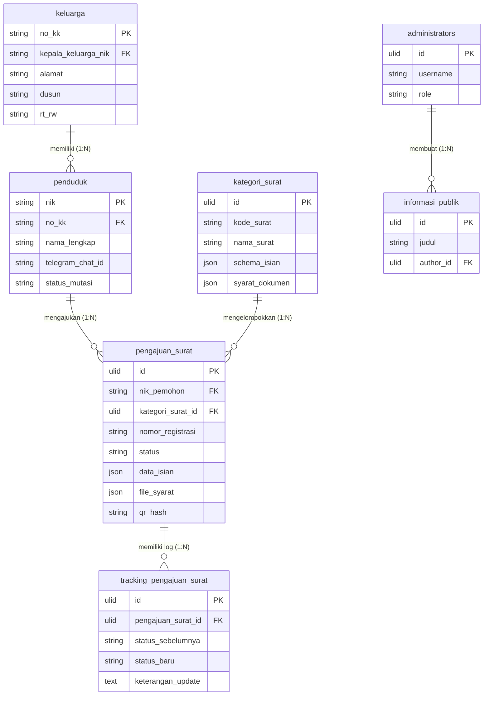

# Dokumentasi Database - SIG-Udeung

Dokumentasi ini merinci skema tabel, relasi, normalisasi data, serta indeks optimasi database untuk platform SIG-Udeung.

---

## 1. Spesifikasi Teknis Database
* **Database Utama**: MySQL 8.0+ / MariaDB (Production)
* **Database Lokal (Development/Testing)**: SQLite
* **Primary Key Format**: Seluruh tabel utama menggunakan ULID (Universally Unique Lexicographically Sortable Identifier) untuk melindungi sistem dari serangan enumeration dan SQL injection, kecuali `referensi_wilayah` yang menggunakan kode wilayah, serta `penduduk` dan `keluarga` yang menggunakan NIK/No KK.

---

## 2. Struktur Relasi Tabel Utama (ERD)

Sistem ini didukung oleh 15 tabel relasional yang dinormalisasi hingga 3NF:

---

## 3. Rincian Tabel Tambahan

* **`bot_knowledges`**: Menyimpan basis pengetahuan (FAQ & RAG Context) untuk Telegram chatbot. Kunci-kunci dicari secara dinamis oleh AI atau sistem bot.
* **`audit_logs`**: Mencatat semua log mutasi database (INSERT, UPDATE, DELETE) lengkap dengan data lama (`data_lama`), data baru (`data_baru`), IP address, dan user agent aktor yang memicu.
* **`pengaturan_gampong`**: Berisi konfigurasi global sistem desa (Key-Value), seperti identitas wilayah, visi misi, serta kredensial API AI dan Cloud Storage.
* **`pengaturan_frontend`**: Menyimpan konfigurasi khusus konten publik, meliputi data nama & foto aparat gampong, kontak layanan warga, serta link akun media sosial resmi desa.
* **`traffic_logs`**: Mencatat log aktivitas kunjungan web publik dan area warga untuk keperluan analisis lalu lintas dan statistik grafik dasbor secara riil.

---

## 4. Indeks & Optimasi Kueri
Untuk memastikan kecepatan eksekusi kueri di bawah 500ms, indeks database dibuat pada kolom-kolom berikut:
* `idx_pengaturan_kunci` pada `pengaturan_gampong(kunci)`
* `idx_penduduk_nama` pada `penduduk(nama_lengkap)`
* `idx_penduduk_no_kk` pada `penduduk(no_kk)`
* `idx_penduduk_status_mutasi` pada `penduduk(status_mutasi)`
* `idx_penduduk_jenis_kelamin` pada `penduduk(jenis_kelamin)`
* `idx_penduduk_tanggal_lahir` pada `penduduk(tanggal_lahir)`
* `idx_keluarga_dusun` pada `keluarga(dusun)`
* `idx_pengajuan_status` pada `pengajuan_surat(status)`
* `idx_pengajuan_nik` pada `pengajuan_surat(nik_pemohon)`
* `idx_pengajuan_created_at` pada `pengajuan_surat(created_at)`
* `idx_mutasi_jenis` pada `mutasi_penduduk(jenis_mutasi)`
* `idx_mutasi_tanggal` pada `mutasi_penduduk(tanggal_mutasi)`
* `idx_chatbot_logs_created_at` pada `chatbot_logs(created_at)`
* `idx_bot_knowledges_kunci` pada `bot_knowledges(kunci)`
* `idx_audit_tabel_record` pada `audit_logs(nama_tabel, record_id)`
* `idx_traffic_logs_created_at` pada `traffic_logs(created_at)`
