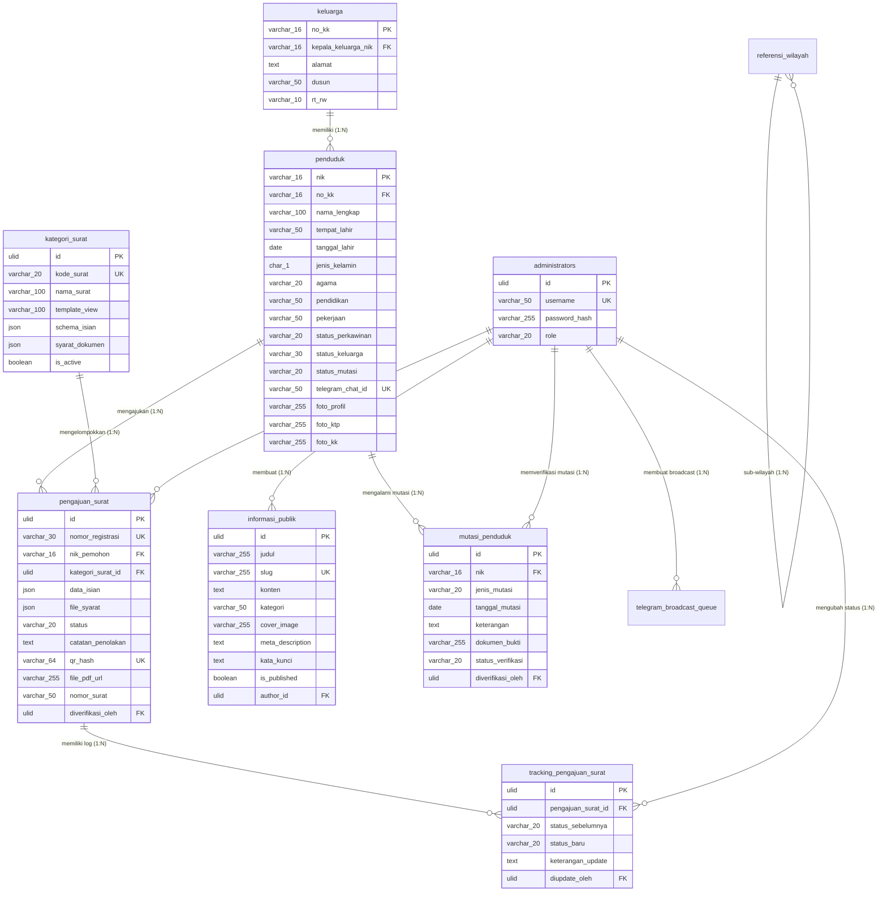

# Dokumentasi Database - SIG-Udeung

Dokumentasi ini merinci skema tabel, relasi, normalisasi data, serta indeks optimasi database untuk platform SIG-Udeung.

---

## 1. Spesifikasi Teknis Database

| Komponen | Spesifikasi |
|----------|-------------|
| Database Utama | MySQL 8.0+ / MariaDB (Production) |
| Database Lokal | SQLite (Development/Testing) |
| Primary Key | ULID (Universally Unique Lexicographically Sortable Identifier) |
| Pengecualian PK | `referensi_wilayah` (kode wilayah), `penduduk` (NIK), `keluarga` (No KK), `pengaturan_frontend` (kunci) |

---

## 2. Struktur Relasi Tabel Utama (ERD)

Sistem ini didukung oleh 18 tabel relasional yang dinormalisasi hingga 3NF:

---

## 3. Rincian Semua Tabel

### 3.1. Tabel `administrators`

Menangani hak akses dan peran di tingkat administrasi desa (Keuchik, Sekdes, Operator).

| Kolom | Tipe | Keterangan |
|-------|------|------------|
| `id` | ULID PRIMARY KEY | Identifier unik administrator |
| `username` | VARCHAR(50) UNIQUE | Username login unik |
| `password` | VARCHAR(255) | Hash kata sandi menggunakan bcrypt |
| `role` | VARCHAR(20) | Peran administratif (keuchik, sekdes, operator) |
| `created_at` | TIMESTAMP | Waktu pembuatan akun |

### 3.2. Tabel `keluarga`

Menyimpan data identitas Kartu Keluarga (KK).

| Kolom | Tipe | Keterangan |
|-------|------|------------|
| `no_kk` | VARCHAR(16) PRIMARY KEY | Nomor KK 16 digit |
| `alamat` | TEXT | Alamat fisik rumah tangga |
| `dusun` | VARCHAR(50) | Nama dusun wilayah gampong |
| `rt_rw` | VARCHAR(10) | RT/RW |
| `kepala_keluarga_nik` | VARCHAR(16) FK | NIK Kepala Keluarga (ON DELETE RESTRICT) |

### 3.3. Tabel `penduduk`

Basis data kependudukan dinamis.

| Kolom | Tipe | Keterangan |
|-------|------|------------|
| `nik` | VARCHAR(16) PRIMARY KEY | NIK 16 digit |
| `no_kk` | VARCHAR(16) FK | Relasi ke Kartu Keluarga (ON DELETE RESTRICT) |
| `nama_lengkap` | VARCHAR(100) | Nama lengkap sesuai KTP |
| `tempat_lahir` | VARCHAR(50) | Tempat lahir |
| `tanggal_lahir` | DATE | Tanggal lahir |
| `jenis_kelamin` | CHAR(1) | L (Laki-laki) atau P (Perempuan) |
| `agama` | VARCHAR(20) | Agama |
| `pendidikan` | VARCHAR(50) | Pendidikan terakhir |
| `pekerjaan` | VARCHAR(50) | Pekerjaan |
| `status_perkawinan` | VARCHAR(20) | Status perkawinan |
| `status_keluarga` | VARCHAR(30) | Hubungan dalam keluarga (Kepala Keluarga, Istri, Anak, dll) |
| `status_mutasi` | VARCHAR(20) DEFAULT 'Tetap' | Status kependudukan (Tetap, Meninggal, Pindah, dll) |
| `telegram_chat_id` | VARCHAR(50) UNIQUE NULL | Chat ID Telegram terhubung untuk bot gateway |
| `foto_profil` | VARCHAR(255) NULL | URL/path foto profil warga |
| `foto_ktp` | VARCHAR(255) NULL | URL/path foto KTP warga |
| `foto_kk` | VARCHAR(255) NULL | URL/path foto Kartu Keluarga warga |

### 3.4. Tabel `mutasi_penduduk`

Riwayat perubahan demografi kependudukan.

| Kolom | Tipe | Keterangan |
|-------|------|------------|
| `id` | ULID PRIMARY KEY | ID unik mutasi |
| `nik` | VARCHAR(16) FK | NIK penduduk (ON DELETE CASCADE) |
| `jenis_mutasi` | VARCHAR(20) | Kelahiran, Kematian, Kedatangan, Kepindahan |
| `tanggal_mutasi` | DATE | Tanggal kejadian mutasi |
| `keterangan` | TEXT | Keterangan detail mutasi |
| `dokumen_bukti` | VARCHAR(255) | Path file bukti surat mutasi |
| `status_verifikasi` | VARCHAR(20) DEFAULT 'Pending' | Pending, Disetujui, Ditolak |
| `diverifikasi_oleh` | ULID NULL FK | ID administrator verifikator |

### 3.5. Tabel `kategori_surat`

Skema surat administratif dinamis.

| Kolom | Tipe | Keterangan |
|-------|------|------------|
| `id` | ULID PRIMARY KEY | ID unik kategori |
| `kode_surat` | VARCHAR(20) UNIQUE | Contoh: SKTM, SKU, Domisili |
| `nama_surat` | VARCHAR(100) | Nama jenis surat |
| `template_view` | VARCHAR(100) | Nama view file blade PDF |
| `schema_isian` | JSON | Struktur skema dinamis form |
| `syarat_dokumen` | JSON | Berkas prasyarat wajib yang harus diunggah |
| `is_active` | BOOLEAN DEFAULT TRUE | Status aktif kategori |

### 3.6. Tabel `pengajuan_surat`

Pencatatan pengajuan surat mandiri oleh warga.

| Kolom | Tipe | Keterangan |
|-------|------|------------|
| `id` | ULID PRIMARY KEY | ID unik pengajuan |
| `nomor_registrasi` | VARCHAR(30) UNIQUE | Nomor register surat formal (auto-generated) |
| `nik_pemohon` | VARCHAR(16) FK | NIK pemohon (ON DELETE CASCADE) |
| `kategori_surat_id` | ULID FK | ID kategori surat (ON DELETE RESTRICT) |
| `data_isian` | JSON | Data variabel yang diisi warga sesuai skema |
| `file_syarat` | JSON | Path file dokumen prasyarat terunggah |
| `status` | VARCHAR(20) DEFAULT 'Pending' | Pending, Diproses, Approved, Rejected |
| `catatan_penolakan` | TEXT NULL | Catatan dari operator jika ditolak |
| `qr_hash` | VARCHAR(64) UNIQUE NULL | Hash dokumen SHA-256 untuk TTE |
| `file_pdf_url` | VARCHAR(255) NULL | URL file dokumen PDF final |
| `nomor_surat` | VARCHAR(50) NULL | Nomor surat resmi yang diterbitkan |
| `diverifikasi_oleh` | ULID NULL FK | ID administrator verifikator |

### 3.7. Tabel `tracking_pengajuan_surat`

Log status persetujuan surat berantai.

| Kolom | Tipe | Keterangan |
|-------|------|------------|
| `id` | ULID PRIMARY KEY | ID unik log tracking |
| `pengajuan_surat_id` | ULID FK | ID pengajuan surat (ON DELETE CASCADE) |
| `status_sebelumnya` | VARCHAR(20) | Status sebelum perubahan |
| `status_baru` | VARCHAR(20) | Status sesudah perubahan |
| `keterangan_update` | TEXT | Keterangan perubahan status |
| `diupdate_oleh` | ULID NULL FK | ID administrator yang mengubah |

### 3.8. Tabel `informasi_publik`

Berita dan siaran pers desa.

| Kolom | Tipe | Keterangan |
|-------|------|------------|
| `id` | ULID PRIMARY KEY | ID unik artikel |
| `judul` | VARCHAR(255) | Judul artikel |
| `slug` | VARCHAR(255) UNIQUE | URL friendly slug (auto-generated) |
| `konten` | TEXT | Konten teks utama (HTML format) |
| `kategori` | VARCHAR(50) | Kategori artikel (Berita, Agenda, Pengumuman) |
| `cover_image` | VARCHAR(255) NULL | URL/path gambar sampul |
| `meta_description` | TEXT NULL | Deskripsi meta untuk SEO |
| `kata_kunci` | TEXT NULL | Kata kunci untuk SEO |
| `is_published` | BOOLEAN DEFAULT FALSE | Status publikasi |
| `author_id` | ULID NULL FK | ID administrator penulis |

### 3.9. Tabel `pengaturan_gampong`

Konfigurasi global sistem desa (key-value).

| Kolom | Tipe | Keterangan |
|-------|------|------------|
| `id` | ULID PRIMARY KEY | ID unik pengaturan |
| `kunci` | VARCHAR(50) UNIQUE | Kunci pengaturan |
| `nilai` | TEXT | Nilai pengaturan |
| `tipe_data` | VARCHAR(20) | Jenis data (string, integer, boolean, json) |
| `deskripsi` | VARCHAR(255) | Keterangan kegunaan |

### 3.10. Tabel `pengaturan_frontend`

Penyimpanan konten statis yang dapat diedit secara dinamis untuk landing page publik.

| Kolom | Tipe | Keterangan |
|-------|------|------------|
| `kunci` | VARCHAR(50) PRIMARY KEY | Kunci pengaturan unik |
| `nilai` | TEXT NULL | Nilai dari pengaturan |
| `tipe_data` | VARCHAR(20) DEFAULT 'string' | Jenis data |
| `deskripsi` | VARCHAR(255) NULL | Keterangan kegunaan |

### 3.11. Tabel `referensi_wilayah`

Master data referensi wilayah administrasi negara.

| Kolom | Tipe | Keterangan |
|-------|------|------------|
| `kode_wilayah` | VARCHAR(15) PRIMARY KEY | Kode wilayah unik |
| `nama_wilayah` | VARCHAR(100) | Nama wilayah |
| `level` | VARCHAR(20) | Level wilayah (provinsi, kabupaten, kecamatan, gampong) |
| `parent_kode` | VARCHAR(15) FK | Kode wilayah induk |

### 3.12. Tabel `bot_knowledges`

Basis pengetahuan (FAQ & RAG Context) untuk Telegram chatbot.

| Kolom | Tipe | Keterangan |
|-------|------|------------|
| `id` | ULID PRIMARY KEY | ID unik catatan pengetahuan |
| `kunci` | VARCHAR(50) UNIQUE | Kunci unik entri |
| `tipe` | VARCHAR(20) | Tipe pengetahuan (faq, perintah, info) |
| `pertanyaan_atau_topik` | VARCHAR(255) | Pertanyaan atau topik terkait |
| `kata_kunci` | JSON | Daftar kata kunci pencocokan |
| `jawaban_atau_konten` | TEXT | Teks jawaban yang dikirim bot |
| `is_aktif` | BOOLEAN | Status aktif/tidaknya entri |

### 3.13. Tabel `chatbot_logs`

Log riwayat interaksi percakapan warga dengan chatbot Telegram.

| Kolom | Tipe | Keterangan |
|-------|------|------------|
| `id` | ULID PRIMARY KEY | ID unik catatan percakapan |
| `telegram_chat_id` | VARCHAR(50) | ID chat Telegram pengguna |
| `pesan_masuk` | TEXT | Teks pesan yang dikirim warga |
| `balasan_ai` | TEXT | Teks balasan yang dihasilkan AI |
| `tokens_used` | INTEGER | Jumlah token API yang terpakai |
| `created_at` | TIMESTAMP | Waktu pesan diterima |

### 3.14. Tabel `telegram_broadcast_queue`

Antrean pengiriman pesan massal (broadcast) Telegram.

| Kolom | Tipe | Keterangan |
|-------|------|------------|
| `id` | ULID PRIMARY KEY | ID unik antrean |
| `pesan` | TEXT | Isi pesan broadcast |
| `kategori_target` | VARCHAR(50) | Target penerima |
| `status` | VARCHAR(20) | Queued, Sending, Sent, Failed |
| `jadwal_kirim` | TIMESTAMP | Waktu terjadwal pengiriman |
| `waktu_selesai` | TIMESTAMP | Waktu pengiriman selesai |
| `created_by` | ULID FK | ID administrator pembuat |

### 3.15. Tabel `audit_logs`

Log riwayat audit aktivitas pengguna/sistem.

| Kolom | Tipe | Keterangan |
|-------|------|------------|
| `id` | ULID PRIMARY KEY | ID unik catatan audit |
| `user_type` | VARCHAR(20) | Tipe pengguna (admin, warga, system) |
| `user_id` | VARCHAR(50) | ID pengguna yang melakukan aksi |
| `tindakan` | VARCHAR(50) | Jenis tindakan (create, update, delete) |
| `nama_tabel` | VARCHAR(50) | Nama tabel yang terdampak |
| `record_id` | VARCHAR(50) | ID record yang dimanipulasi |
| `data_lama` | JSON | Data sebelum perubahan |
| `data_baru` | JSON | Data setelah perubahan |
| `ip_address` | VARCHAR(45) | Alamat IP pengguna |
| `user_agent` | TEXT | User-agent browser/perangkat |
| `created_at` | TIMESTAMP | Waktu pencatatan audit |

### 3.16. Tabel `traffic_logs`

Pencatatan statistik kunjungan publik secara otomatis.

| Kolom | Tipe | Keterangan |
|-------|------|------------|
| `id` | ULID PRIMARY KEY | ID kunjungan unik |
| `ip_address` | VARCHAR(45) NULL | Alamat IP penjelajah |
| `user_agent` | TEXT NULL | Informasi platform/browser |
| `path` | VARCHAR(255) NULL | Alamat URI yang dikunjungi |
| `method` | VARCHAR(10) NULL | HTTP request method (GET, POST, dll) |
| `referer` | VARCHAR(255) NULL | URL asal lalu lintas |
| `is_bot` | BOOLEAN DEFAULT FALSE | Menandai kunjungan dari bot |
| `created_at` | TIMESTAMP | Waktu kunjungan |

---

## 4. Indeks & Optimasi Kueri

Untuk memastikan kecepatan eksekusi kueri di bawah 500ms, indeks database dibuat pada kolom-kolom berikut:

| Indeks | Tabel | Kolom |
|--------|-------|-------|
| `idx_pengaturan_kunci` | `pengaturan_gampong` | `kunci` |
| `idx_penduduk_nama` | `penduduk` | `nama_lengkap` |
| `idx_penduduk_no_kk` | `penduduk` | `no_kk` |
| `idx_penduduk_status_mutasi` | `penduduk` | `status_mutasi` |
| `idx_penduduk_jenis_kelamin` | `penduduk` | `jenis_kelamin` |
| `idx_penduduk_tanggal_lahir` | `penduduk` | `tanggal_lahir` |
| `idx_keluarga_dusun` | `keluarga` | `dusun` |
| `idx_pengajuan_status` | `pengajuan_surat` | `status` |
| `idx_pengajuan_nik` | `pengajuan_surat` | `nik_pemohon` |
| `idx_pengajuan_created_at` | `pengajuan_surat` | `created_at` |
| `idx_mutasi_jenis` | `mutasi_penduduk` | `jenis_mutasi` |
| `idx_mutasi_tanggal` | `mutasi_penduduk` | `tanggal_mutasi` |
| `idx_chatbot_logs_created_at` | `chatbot_logs` | `created_at` |
| `idx_bot_knowledges_kunci` | `bot_knowledges` | `kunci` |
| `idx_audit_tabel_record` | `audit_logs` | `nama_tabel, record_id` |
| `idx_traffic_logs_created_at` | `traffic_logs` | `created_at` |
