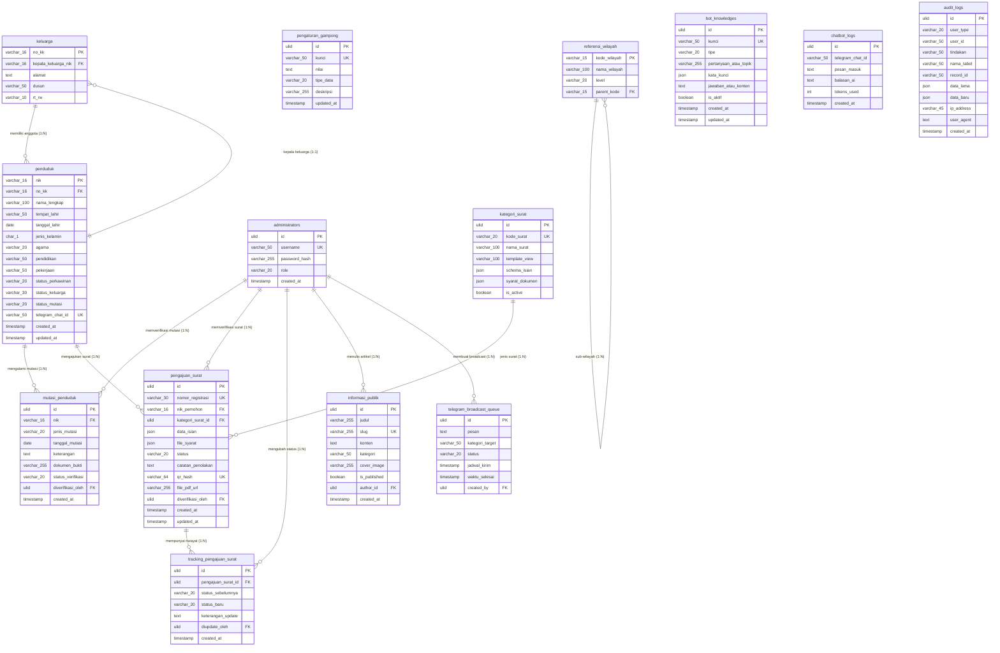

# Dokumentasi Entity Relationship Diagram (ERD) - SIG-Udeung

Dokumen ini menjelaskan struktur data lengkap, relasi antarentitas, tipe data (standar MySQL/MariaDB), indeks optimasi, serta konstrain integritas data pada platform SIG-Udeung.

---

## 1. Peta ERD (Mermaid Diagram)

Diagram berikut memetakan seluruh tabel dalam database SIG-Udeung beserta relasinya:

---

## 2. Struktur Detail Tabel

### 2.1. Tabel `users` & `administrators`
Menangani hak akses dan peran di tingkat administrasi desa (Keuchik, Sekdes, Operator).
* **`administrators`**:
  * `id`: `ULID PRIMARY KEY` -> Identifier unik administrator.
  * `username`: `VARCHAR(50) UNIQUE` -> Username login unik.
  * `password_hash`: `VARCHAR(255)` -> Hash kata sandi menggunakan bcrypt.
  * `role`: `VARCHAR(20)` -> Peran administratif (Keuchik, Sekdes, Operator).
  * `created_at`: `TIMESTAMP DEFAULT CURRENT_TIMESTAMP`.

### 2.2. Tabel `keluarga`
Menyimpan data identitas Kartu Keluarga (KK).
* `no_kk`: `VARCHAR(16) PRIMARY KEY` -> Nomor KK 16 digit.
* `alamat`: `TEXT` -> Alamat fisik rumah tangga.
* `dusun`: `VARCHAR(50)` -> Nama dusun wilayah gampong.
* `rt_rw`: `VARCHAR(10)` -> RT/RW.
* `kepala_keluarga_nik`: `VARCHAR(16) FOREIGN KEY REFERENCES penduduk(nik) ON DELETE RESTRICT` -> NIK Kepala Keluarga.

### 2.3. Tabel `penduduk`
Basis data kependudukan dinamis.
* `nik`: `VARCHAR(16) PRIMARY KEY` -> NIK 16 digit.
* `no_kk`: `VARCHAR(16) FOREIGN KEY REFERENCES keluarga(no_kk) ON DELETE RESTRICT` -> Relasi ke Kartu Keluarga.
* `nama_lengkap`: `VARCHAR(100)` -> Nama lengkap sesuai KTP.
* `tempat_lahir`: `VARCHAR(50)`.
* `tanggal_lahir`: `DATE`.
* `jenis_kelamin`: `CHAR(1)` -> L (Laki-laki) atau P (Perempuan).
* `agama`: `VARCHAR(20)`.
* `pendidikan`: `VARCHAR(50)`.
* `pekerjaan`: `VARCHAR(50)`.
* `status_perkawinan`: `VARCHAR(20)`.
* `status_keluarga`: `VARCHAR(30)` -> Hubungan dalam keluarga (Kepala Keluarga, Istri, Anak, dll).
* `status_mutasi`: `VARCHAR(20) DEFAULT 'Tetap'` -> Status kependudukan (Tetap, Meninggal, Pindah, dll).
* `telegram_chat_id`: `VARCHAR(50) UNIQUE NULL` -> Chat ID Telegram terhubung untuk bot gateway.

### 2.4. Tabel `mutasi_penduduk`
Riwayat perubahan demografi kependudukan.
* `id`: `ULID PRIMARY KEY`.
* `nik`: `VARCHAR(16) FOREIGN KEY REFERENCES penduduk(nik) ON DELETE CASCADE`.
* `jenis_mutasi`: `VARCHAR(20)` -> Kelahiran, Kematian, Kedatangan, Kepindahan.
* `tanggal_mutasi`: `DATE`.
* `keterangan`: `TEXT`.
* `dokumen_bukti`: `VARCHAR(255)` -> Path file bukti surat mutasi.
* `status_verifikasi`: `VARCHAR(20) DEFAULT 'Pending'` -> Pending, Disetujui, Ditolak.
* `diverifikasi_oleh`: `ULID NULL FOREIGN KEY REFERENCES administrators(id)`.

### 2.5. Tabel `kategori_surat`
Skema surat administratif dinamis.
* `id`: `ULID PRIMARY KEY`.
* `kode_surat`: `VARCHAR(20) UNIQUE` -> Contoh: SKTM, SKU, Domisili.
* `nama_surat`: `VARCHAR(100)`.
* `template_view`: `VARCHAR(100)` -> Nama view file blade PDF.
* `schema_isian`: `JSON` -> Struktur skema dinamis form Vue.
* `syarat_dokumen`: `JSON` -> Berkas prasyarat wajib yang harus diunggah.
* `is_active`: `BOOLEAN DEFAULT TRUE`.

### 2.6. Tabel `pengajuan_surat`
Pencatatan pengajuan surat mandiri oleh warga.
* `id`: `ULID PRIMARY KEY`.
* `nomor_registrasi`: `VARCHAR(30) UNIQUE` -> Nomor register surat formal.
* `nik_pemohon`: `VARCHAR(16) FOREIGN KEY REFERENCES penduduk(nik) ON DELETE CASCADE`.
* `kategori_surat_id`: `ULID FOREIGN KEY REFERENCES kategori_surat(id) ON DELETE RESTRICT`.
* `data_isian`: `JSON` -> Data variabel yang diisi warga sesuai skema.
* `file_syarat`: `JSON` -> Path file dokumen prasyarat terunggah.
* `status`: `VARCHAR(20) DEFAULT 'Pending'` -> Pending, Approved, Rejected.
* `catatan_penolakan`: `TEXT NULL` -> Catatan dari operator jika ditolak.
* `qr_hash`: `VARCHAR(64) UNIQUE NULL` -> Hash dokumen SHA-256 untuk TTE.
* `file_pdf_url`: `VARCHAR(255) NULL` -> URL file dokumen PDF final.
* `diverifikasi_oleh`: `ULID NULL FOREIGN KEY REFERENCES administrators(id)`.

### 2.7. Tabel `tracking_pengajuan_surat`
Log status persetujuan surat berantai.
* `id`: `ULID PRIMARY KEY`.
* `pengajuan_surat_id`: `ULID FOREIGN KEY REFERENCES pengajuan_surat(id) ON DELETE CASCADE`.
* `status_sebelumnya`: `VARCHAR(20)`.
* `status_baru`: `VARCHAR(20)`.
* `keterangan_update`: `TEXT`.
* `diupdate_oleh`: `ULID NULL FOREIGN KEY REFERENCES administrators(id)`.

### 2.8. Tabel `informasi_publik`
Berita dan siaran pers desa.
* `id`: `ULID PRIMARY KEY`.
* `judul`: `VARCHAR(255)`.
* `slug`: `VARCHAR(255) UNIQUE` -> URL friendly slug.
* `konten`: `TEXT` -> Konten teks utama (HTML format).
* `kategori`: `VARCHAR(50)`.
* `cover_image`: `VARCHAR(255) NULL`.
* `is_published`: `BOOLEAN DEFAULT FALSE`.
* `author_id`: `ULID NULL FOREIGN KEY REFERENCES administrators(id)`.

---

## 3. Aturan Relasi Terikat & Integritas

1. **One-to-Many (`keluarga` ke `penduduk`)**:
   * Satu keluarga (`keluarga`) memiliki satu atau banyak anggota keluarga (`penduduk`).
   * Penghapusan data keluarga dibatasi (`ON DELETE RESTRICT`) jika masih ada penduduk yang terikat pada `no_kk` tersebut.
2. **One-to-One (`penduduk` ke `keluarga` sebagai kepala keluarga)**:
   * Setiap keluarga memiliki satu kepala keluarga yang diidentifikasi oleh `kepala_keluarga_nik`.
3. **Cascading Delete pada Transaksi**:
   * Jika data `penduduk` dihapus, seluruh data transaksi terkait seperti `mutasi_penduduk` dan `pengajuan_surat` akan dihapus secara otomatis (`ON DELETE CASCADE`) untuk mencegah residu data tak terikat.
